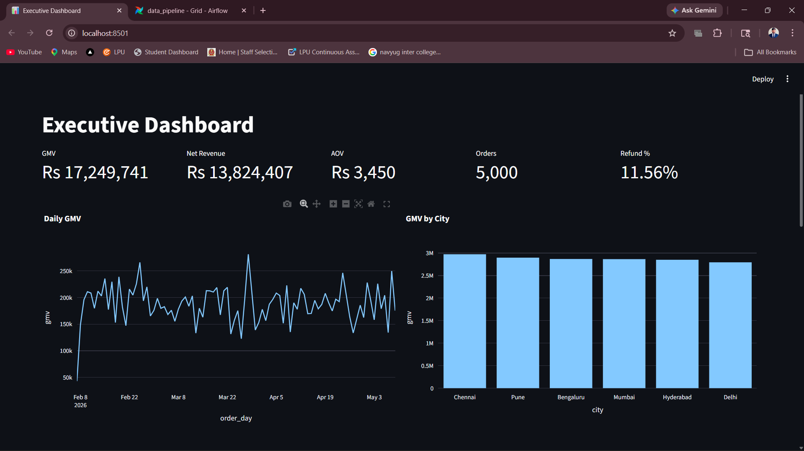

# Data Engineering Platform

## Executive Dashboard




A production-inspired end-to-end **Data Engineering + Analytics Engineering** project simulating a modern quick-commerce fashion startup.

This platform demonstrates how raw operational data flows through ingestion, transformation, warehouse modeling, monitoring, orchestration, and executive analytics reporting.

---

## Project Overview

This project simulates a startup-style data platform that handles:

- Order processing
- User analytics
- Inventory monitoring
- Campaign performance tracking
- Executive KPI reporting
- Event stream analytics
- Data quality monitoring
- Automated orchestration using Apache Airflow

The goal of this project was to build a realistic data engineering workflow instead of a basic CSV-cleaning project.

---

##  Key Features

##  End-to-End ETL Pipelines

- Data ingestion pipelines
- Transformation pipelines
- Warehouse loading pipelines
- Feature engineering workflows

##  Dimensional Data Warehouse

Implemented star-schema inspired modeling:

- `fact_orders`
- `fact_events`
- `dim_users`
- `dim_products`
- `dim_campaigns`
- `dim_time`

##  Business KPI Analytics

Executive metrics including:

- GMV (Gross Merchandise Value)
- Net Revenue
- Refund Rate
- Average Order Value
- Repeat User Analysis
- Campaign ROI
- Inventory Health

##  Monitoring & Data Quality

Implemented checks for:

- Null values
- Duplicate records
- Data freshness
- Schema validation

##  Interactive Dashboard

Built using:

- Streamlit
- Plotly
- SQL-based reporting queries

##  Dockerized Airflow Orchestration

- Apache Airflow setup using Docker
- PostgreSQL metadata backend
- Automated DAG scheduling
- Pipeline orchestration

---

#  Architecture

```text
                    +-------------------+
                    | Synthetic Data    |
                    | Generation Layer  |
                    +---------+---------+
                              |
                              v
                    +-------------------+
                    | Ingestion Layer   |
                    | (CSV Pipelines)   |
                    +---------+---------+
                              |
                              v
                    +-------------------+
                    | Transformation    |
                    | Layer             |
                    +---------+---------+
                              |
                              v
                    +-------------------+
                    | Warehouse Layer   |
                    | SQLite            |
                    +---------+---------+
                              |
               +--------------+--------------+
               |                             |
               v                             v
      +-------------------+       +-------------------+
      | Monitoring Layer  |       | Analytics Layer   |
      | Data Quality      |       | KPI Reporting     |
      +-------------------+       +-------------------+
                              |
                              v
                    +-------------------+
                    | Streamlit         |
                    | Executive Dashboard|
                    +-------------------+
                              |
                              v
                    +-------------------+
                    | Apache Airflow    |
                    | Dockerized DAGs   |
                    +-------------------+
````

---

#  Tech Stack

| Category         | Technologies               |
| ---------------- | -------------------------- |
| Programming      | Python                     |
| Data Processing  | Pandas, NumPy              |
| Database         | SQLite, PostgreSQL         |
| Dashboarding     | Streamlit, Plotly          |
| Orchestration    | Apache Airflow             |
| Containerization | Docker                     |
| Configuration    | YAML                       |
| Monitoring       | Logging, Validation Checks |

---

#  Project Structure


```text
data-engineering-platform/
│
├── airflow/
│   ├── dags/
│   │   └──pipeline_dag.py
│   ├── logs/
│   ├── plugins/
│   └── config/
│
├── dashboards/
│   └── executive_dashboard.py
│
├── data/
│   ├── raw/
│   ├── processed/
│   └── warehouse/
│
├── monitoring/
│   └── data_quality.py
│
├── pipelines/
│   ├── ingest/
│   ├── transform/
│   └── warehouse/
│
├── sql/
│
├── utils/
│   ├── db.py
│   ├── helpers.py
│   └── logger.py
│
├── docker-compose.yaml
├── main.py
├── requirements.txt
└── README.md
```

---

#  Pipeline Workflow

## 1️ Synthetic Data Generation

Generates startup-like datasets for:

* Orders
* Users
* Inventory
* Campaigns
* Events
* Payments
* Refunds

---

## 2️ Ingestion Layer

Raw datasets are ingested into the processing pipeline.

---

## 3️ Transformation Layer

Business transformations include:

* Revenue calculations
* Repeat user tagging
* User feature engineering
* Campaign ROI calculations
* Inventory aggregations

---

## 4️ Warehouse Layer

Transformed datasets are loaded into analytical warehouse tables.

---

## 5️ Monitoring Layer

Data quality checks validate:

* freshness
* duplicates
* schema consistency
* missing values

---

## 6️ Analytics Layer

Business-ready KPI reporting for dashboards and executive insights.

---

#  Docker + Airflow Setup

## Step 1 — Start Docker

Make sure Docker Desktop is running.

---

## Step 2 — Run Airflow

```bash
docker compose up
```

---

## Step 3 — Open Airflow UI

```text
http://localhost:8081
```

---

## Step 4 — Login

```text
username: admin
password: admin
```

---

#  Dashboard

Run Streamlit dashboard:

```bash
streamlit run dashboards/executive_dashboard.py
```

Dashboard includes:

* Executive KPIs
* Revenue analytics
* Campaign ROI
* Inventory monitoring
* City-wise GMV
* Product performance

---

#  Running the Main Pipeline

```bash
python main.py
```

---

#  Airflow DAG

The project includes a Dockerized Airflow DAG:

```text
data_pipeline
```

This DAG automates:

* ingestion
* transformation
* warehouse loading
* monitoring workflows

---

#  Business Metrics

## Executive KPIs

| Metric       | Description             |
| ------------ | ----------------------- |
| GMV          | Gross Merchandise Value |
| Net Revenue  | Revenue after refunds   |
| AOV          | Average Order Value     |
| Refund Rate  | Refund percentage       |
| Repeat Users | Returning customers     |
| Campaign ROI | Marketing performance   |

---

#  Monitoring & Reliability

Implemented:

* centralized logging
* schema validation
* duplicate checks
* null checks
* freshness checks

---

#  Learning Outcomes

This project demonstrates practical understanding of:

* ETL pipeline design
* data warehouse modeling
* analytics engineering
* orchestration using Airflow
* Docker containerization
* business KPI reporting
* monitoring and validation
* startup-style data platform architecture

---

#  Future Improvements

Planned upgrades:

* Incremental loading
* PostgreSQL warehouse migration
* dbt integration
* CI/CD pipelines
* Cloud deployment
* Task-level DAG separation
* Alerting & retry mechanisms
* Great Expectations integration

---

#  Author

**Govind Singh Rajput**

Aspiring Data Engineer focused on building production-inspired data platforms and analytics systems.

```
```
